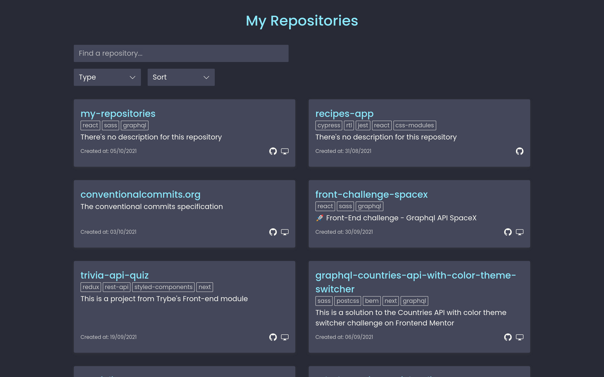
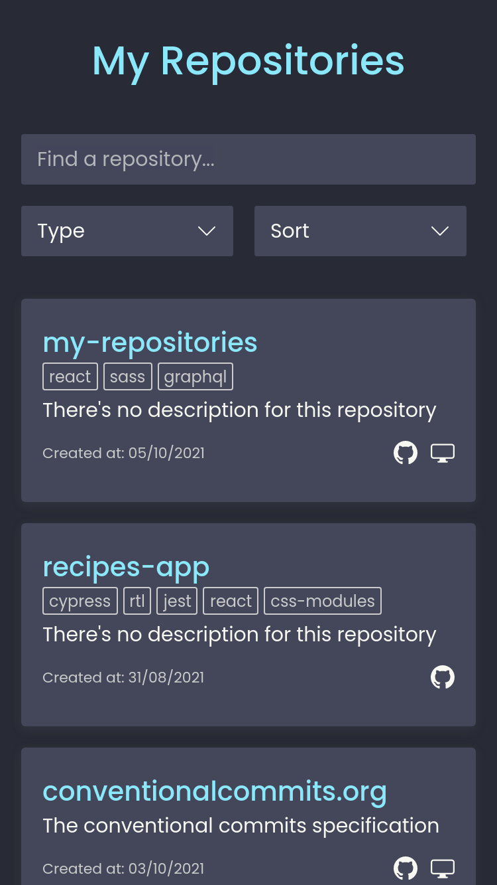

# 🚀 Front-End challenge - Graphql API SpaceX
Esse app exibe a lista dos meus repositórios usando a API GraphQL pública do GitHub

## Sumário

- [A proposta](#a-proposta)
- [Screenshots](#screenshots)
- [Tecnologias](#tecnologias)

## A proposta

Essa listagem precisa conter:

- Funcionalidade de filtro por pelo menos 3 atributos (exemplo, exibir somente repositórios arquivados)
- Funcionalidade de ordenação alfabética e por data do ultimo commit
- Funcionalidade de pesquisa simples (exemplo, pesquiso por "node" e vejo a lista de repositórios que possuem a string "node" em parte do nome

## Screenshots

## Tecnologias
- [React](https://reactjs.org/)
- [QraphQL Request](https://github.com/prisma-labs/graphql-request)
- [Sass](https://sass-lang.com/)
